# NerdBox - Interface web

#### About the project:
   The NerdBox project was developed as an academic exercise to the Full Stack Developer course at [Infnet Institute](https://www.infnet.edu.br/infnet/).

#### Project Description:
   The project is a web application for a store. The business model works as a subscription service. The project has two types of users, clients and the store admin. 
   
    Admin Actions:
        - Create, edit and remove products (boxes)
    Client Actions:
        - login/logout
        - Register to the store
        - Subscribe/ Unsubscribe to a product (boxes)
        - Edit his account info
   
#### About this repository:
   This is the interface web of the NerdBox Project, was developed to interact with the project's ApiRest, that can be found on this link => [NerdBox Backend repo](https://github.com/sue1en/NerdBox-Api/blob/main/README.md).
    The project was build using React and some others libs ( full list at the [project packege.json](https://github.com/sue1en/NerdBox-Front-End/blob/main/package.json) ).
    
## Tecnologies/ Libs
  - JavaScript
  - NodeJS
  - React
  - Redux
  - Axios
  - reactstrap
  - html 5
  - css 3
  - React Router Dom
  - Styled Components


## Requeriment:
  - NodeJS

## Developers:
- Felipe Siqueira [GitHub](https://github.com/fsiq-dev)
- Suelen Batista [GitHub](https://github.com/sue1en)

## First Steps:
1. Download and install [NodeJS](https://nodejs.org/en/) (choose the option for your operating system). If you already has the nodeJS in your computer go to the next step.
2. Clone the project to a folder of your choice.
3. At the terminal in the project main folder, install the dependencies with the command <b>`npm install`</b> or <b>`yarn install`</b> to install with yarn.
4. To run this project properly you will need the Api of this project. You can find the project at this link [NerdBox Backend](https://github.com/sue1en/NerdBox-Api/blob/main/README.md).
5. To integrate with the Api, create a file with this name <b>`.env`</b>. At the file, fallow the example below:
  ```
  
    REACT_APP_API='http://localhost:3333/v2'
      
      *obs: /v2 is relatad to the version 2 routes.
  ```
8. To run the project type <b>`yarn start`</b> at the terminal.

#
## Project screem images:

#### Desktop/ Laptop:

| Main Page | Login Page | User Edit Profile |
| :---: | :---: | :---: |
| 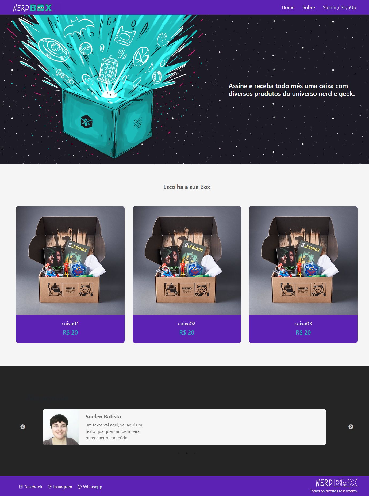 | 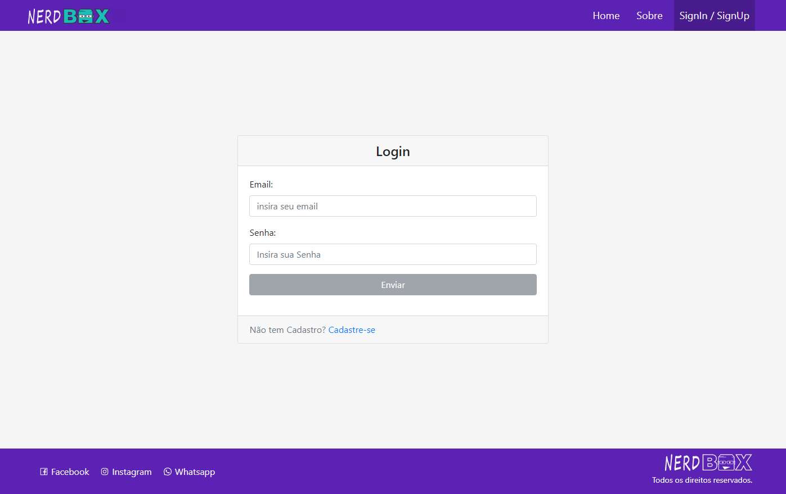 | 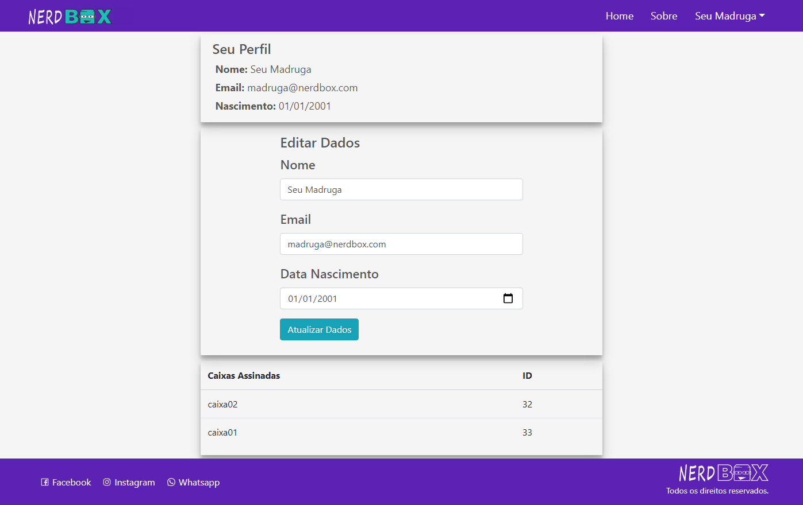 |
| **Box Details Page** | **Box Details Admin Page** | **Admin Boxes Panel Page** |
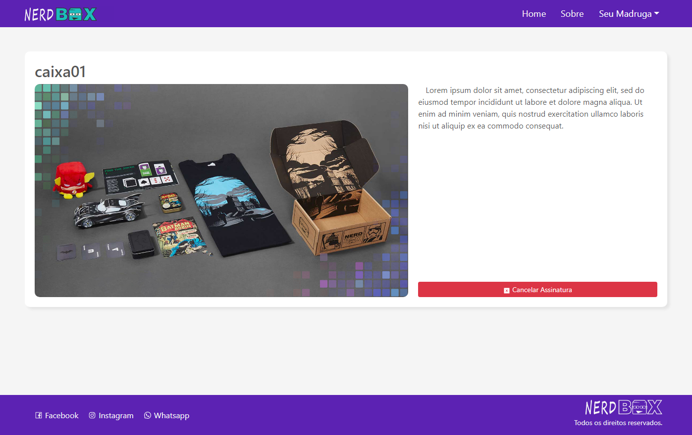 | 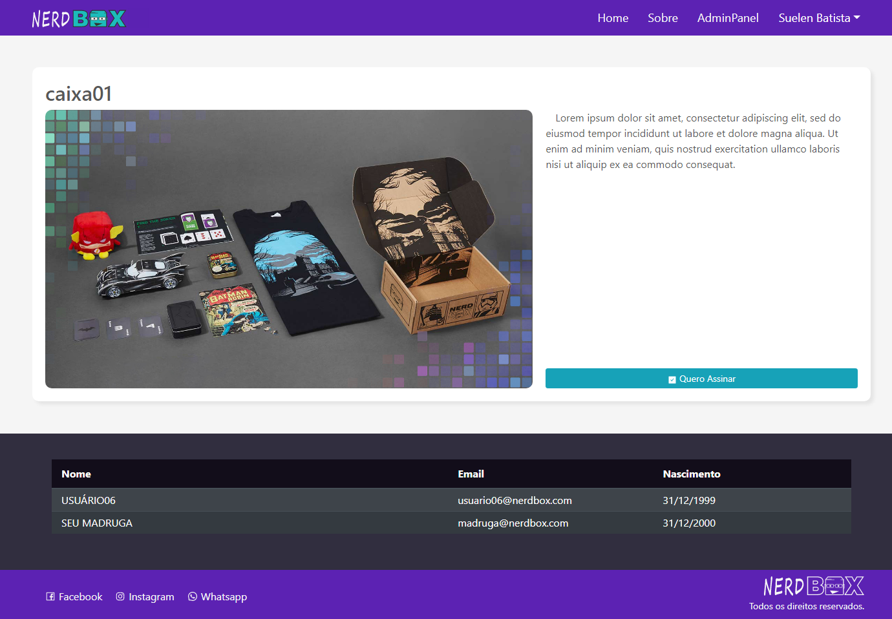 | 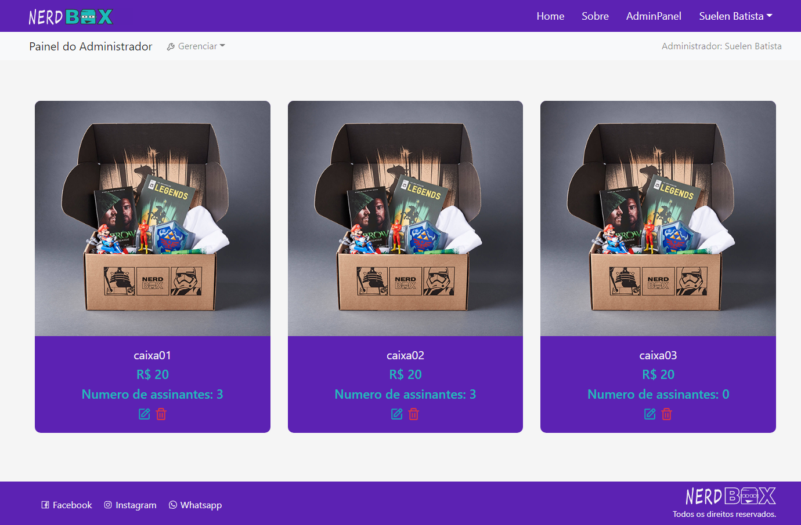 |
| **Admin Boxes Panel - Update Box** |
| 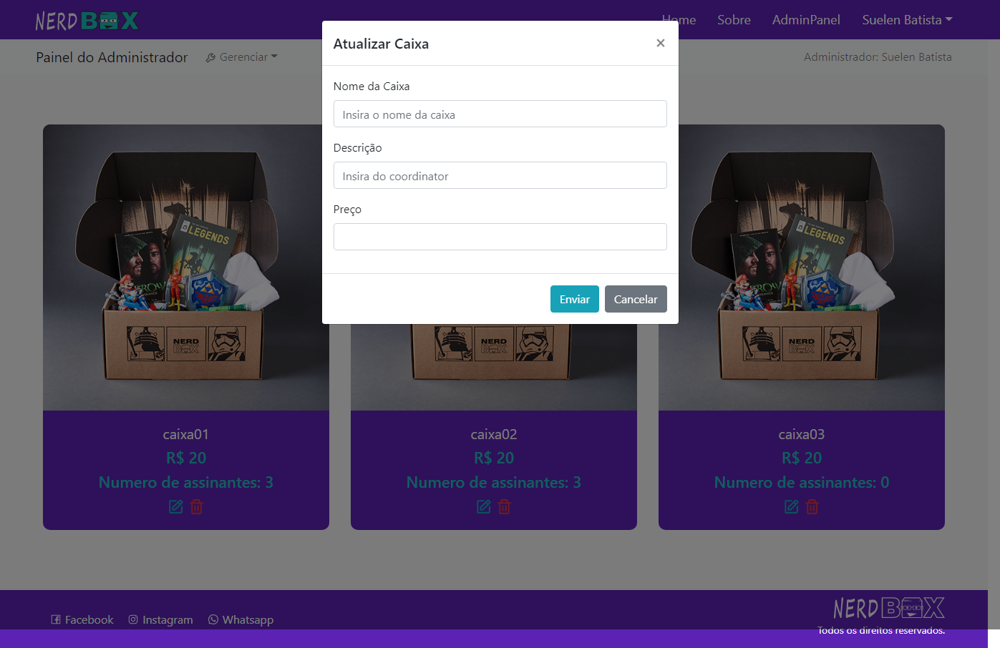 | 
  
#### Mobile:
  
| Main Page | User Edit Profile | Login Page | Box Details Page |
| :---: | :---: | :---: | :---: |
| 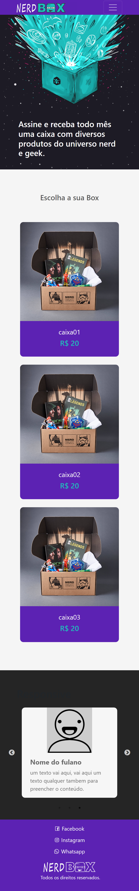 | 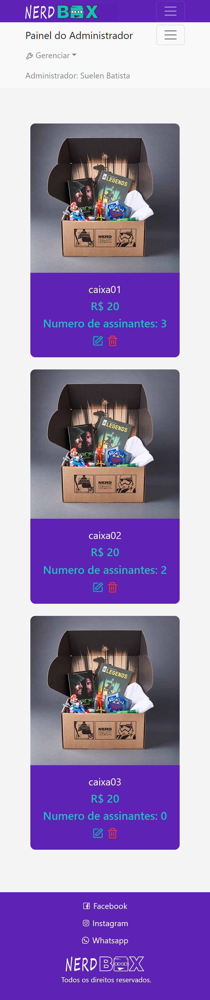 | 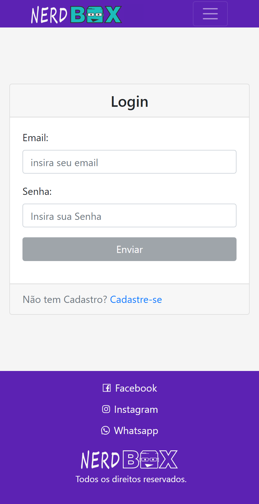 | 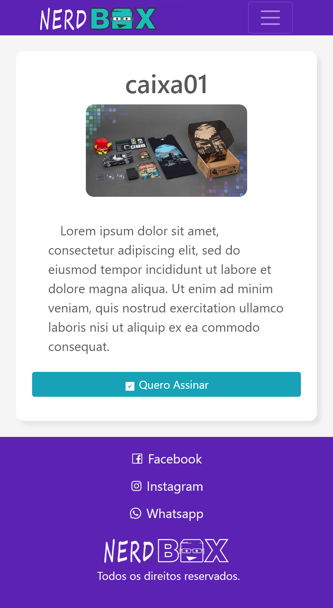 |
    
<!-- #### Demo:
  - Demo: -->
  
<!--        -->
